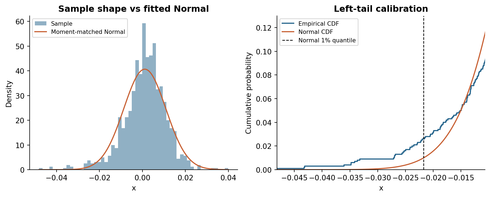
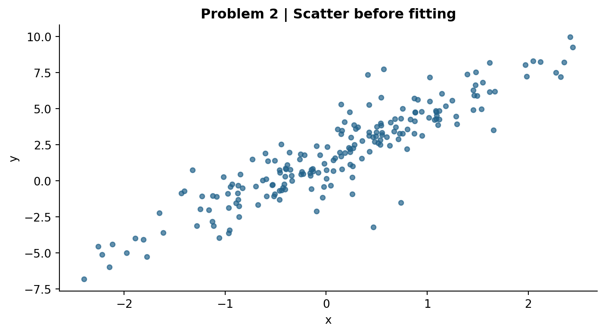
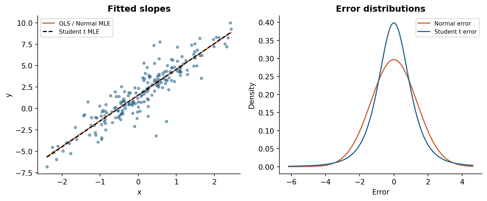
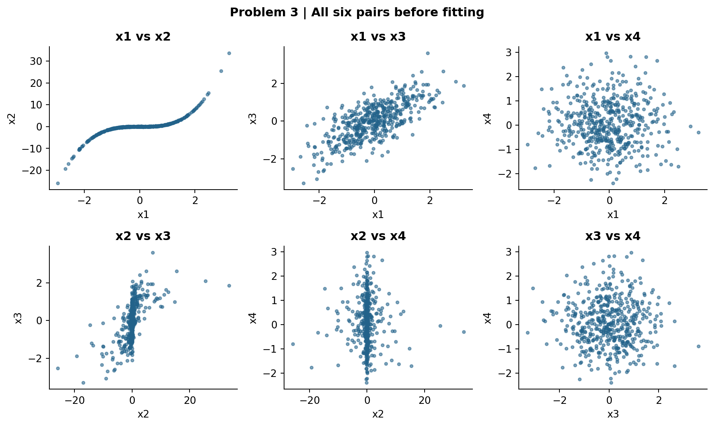
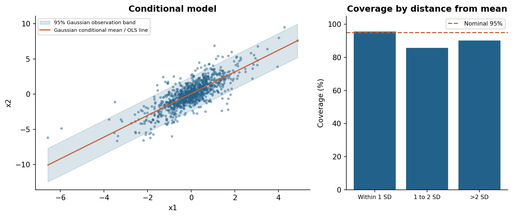
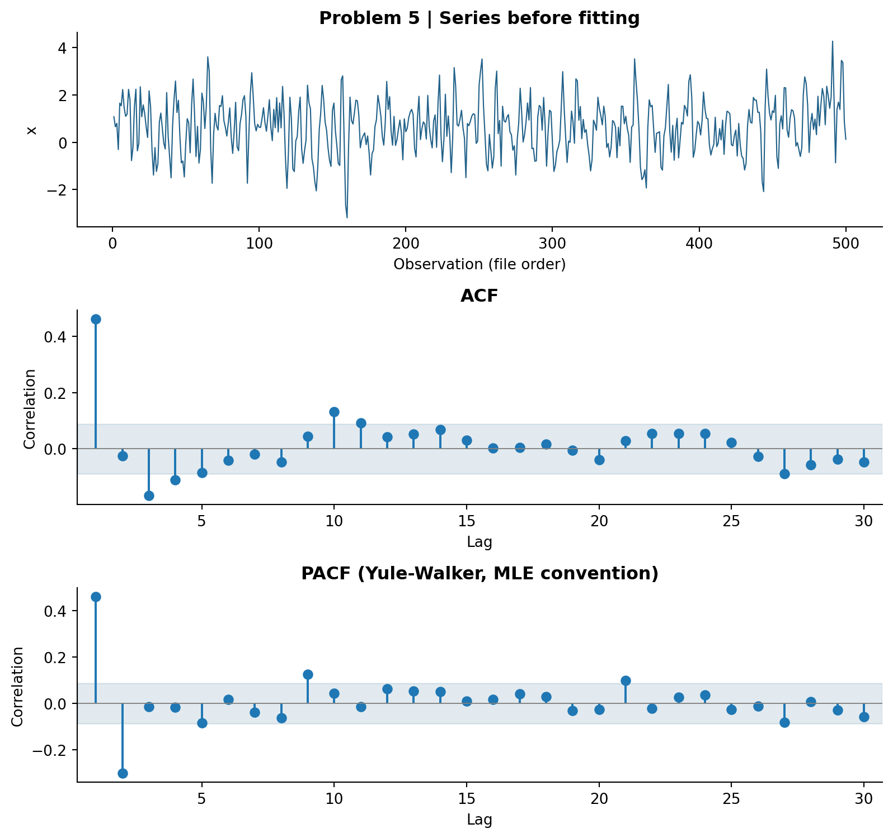

# Assignment 1

FinTech 545 - Quantitative Risk Management

For each problem, I first look at the data and make a prediction, then fit the models and compare the results with my prediction. The calculations use the five CSV files supplied with the assignment.

## 1. Reading the shape of a sample

I used the 1000 observations in problem1.csv to calculate the first four moments. The variance uses n - 1. For skewness and excess kurtosis, I used the bias-corrected estimates. I also report the uncorrected values below. Here, m_r = (1/n) Σ(x_i - x̄)^r.

| Statistic | Value |
| --- | --- |
| Mean | 0.001104394 |
| Sample variance, denominator n - 1 | 0.0000962482 |
| Bias-corrected skewness | -0.669837 |
| Bias-corrected excess kurtosis | 2.357614 |
| Uncorrected standardized skewness | -0.668831 |
| Uncorrected excess kurtosis | 2.339849 |
| Central third moment m3 (not standardized) | -6.306000443e-07 |
| Central fourth moment m4 (not standardized) | 4.936797883e-08 |

## 1(a) Predict: candidate distributions

The skewness is negative, so the sample has a longer left tail. The positive excess kurtosis suggests heavier tails than a Normal distribution. Based on these two features, I think a negatively skewed **Normal Inverse Gaussian (NIG)** is a reasonable choice from Week 1 because it allows both skewness and heavy tails.

I would rule out the **Normal** as a good match because its skewness and excess kurtosis are both zero. The usual **Student t** can explain heavy tails, but it is symmetric and cannot explain negative population skewness when that moment exists. The **lognormal** has positive skewness, which is the opposite of this sample. The skewed t and generalized hyperbolic families briefly mentioned in the notes could also be possible, but NIG is the main candidate among the four distributions covered in detail.

These conclusions are based on sample moments, so they do not prove which distribution generated the data. For example, a sample from a symmetric distribution can still have nonzero skewness. Before fitting, I expect the Normal model to underestimate the left tail, giving more than 10 observations below its 1% quantile.

# 1. Fit and explanation

## 1(b) Fit: match the sample mean and variance

I fit the Normal by setting μ = x̄ = 0.001104394 and σ² = s² = 0.0000962482. The standard deviation is 0.009810618. I then calculate its 1% quantile:

q_0.01 = μ + σ Φ^-1(0.01) = **-0.021718516**.

| Quantity | Result |
| --- | --- |
| Observed number strictly below the Normal 1% quantile | 26 |
| Expected number under the fitted model: 1,000 × 0.01 | 10 |
| Observed fraction below that cutoff | 2.60% |
| Empirical 1% quantile (linear interpolation) | -0.026994449 |

## 1(c) Reconcile: where the Normal is wrong

There are **26** observations below this cutoff, compared with **10** expected under the Normal model. That is 2.6 times the expected count. This agrees with my prediction: the fitted Normal assigns too little probability to large negative values.

The empirical 1% quantile is more negative than the Normal 1% quantile. Therefore, using the Normal would underestimate the size of an extreme negative outcome at this probability level. The histogram also shows a more concentrated center and a heavier left tail than the Normal curve. Matching the mean and variance does not capture these differences in shape.

The count of 10 is the number implied by the fitted model. I use the comparison as a check of the tail fit, rather than as a formal hypothesis test.

# 2. A regression whose errors are not Normal

## 2(a) Predict from the scatter

The scatter shows a clear positive, roughly linear relationship. Most points are fairly close to a line, but a few are much farther above or below it. I do not see an obvious increase in spread as x increases. I would expect a Student t error because it can allow these larger errors while keeping most observations near the line. The plot alone is not enough to confirm the distribution.

## 2(b) Predict the effect on the slope and its standard error

This appears to violate **assumption 7: the errors are normally distributed**, from Week 2. I expect the OLS slope to remain close to the main trend, although large residuals may move it somewhat. Non-normality alone does not make the slope biased if E[ε | X] = 0.

For the standard error, I expect the large residuals to make the estimate more sensitive to individual observations. However, I would not automatically say that the standard error is too small or too large. With uncorrelated errors, constant finite variance, and E[ε | X] = 0, the usual OLS variance formula σ²(X′X)^-1 still applies without normal errors. What becomes less reliable is using the usual exact small-sample t tests and confidence intervals.

# 2. Fit: OLS, Normal MLE, and Student t MLE

I fit y_i = α + βx_i + ε_i with OLS, Normal MLE, and Student t MLE. The error location is set to zero because the intercept already accounts for location. For the t model, ε = sT_ν. Its scale s is different from its standard deviation.

| Method | α | β | Error scale | ν |
| --- | --- | --- | --- | --- |
| OLS | 1.560740 | 2.990757 | 1.351401 | - |
| Normal MLE | 1.560740 | 2.990757 | 1.344627 | - |
| Student t MLE | 1.547979 | 3.019179 | 0.935509 | 3.632163 |

The OLS standard errors are **SE(α̂) = 0.096269** and **SE(β̂) = 0.096640**. OLS estimates the residual SD using sqrt(SSE/(n - 2)), giving 1.351401. Normal MLE uses sqrt(SSE/n), giving 1.344627. The slopes and intercepts are identical because maximizing the Normal likelihood gives the same coefficient estimates as minimizing squared errors.

The fitted t has ν = 3.632163 and scale s = 0.935509. Using the formula from Week 1, its error SD is s sqrt(ν/(ν - 2)) = 1.395562. Its variance exists because ν > 2, but its fourth moment is not finite because ν < 4.

## Likelihood and model selection

Normal: ℓ = -(n/2) log(2πσ²) - SSE/(2σ²).
Student t: ℓ = Σ [log f_Tν((y_i - α - βx_i)/s) - log s].

For the t model, I maximize the log likelihood over the intercept, slope, scale, and degrees of freedom. I tried five starting values for the degrees of freedom, and they gave the same fitted result.

AICc = -2ℓ + 2k + 2k(k + 1)/(n - k - 1), with n = 200.

| Model / likelihood | k | Log likelihood | AICc |
| --- | --- | --- | --- |
| OLS evaluated at Normal MLE scale | 3 | -343.011037 | 692.144523 |
| Normal MLE | 3 | -343.011037 | 692.144523 |
| Student t MLE | 4 | -328.561179 | 665.327487 |

I count k = 3 parameters for the Normal model (α, β, σ) and k = 4 for the t model (α, β, s, ν). For OLS, I evaluate AICc using the Normal likelihood at its MLE scale, so its AICc is the same as Normal MLE. The **t model has the lower AICc** by 26.817036, so I choose it.

# 2. Comparing the results

## 2(c-d) Slopes and error distributions

The OLS and Normal-MLE slopes are 2.990757, while the t slope is 3.019179. The difference is 0.028422, or about 0.95% of the OLS slope. This is small relative to the OLS slope standard error, so the result agrees with my prediction that the slopes would stay close.

The main problem with the Normal model is the **distribution of errors around the line**, rather than the line itself. It needs a larger scale to account for the large residuals. This makes it too spread out around the center, yet its far tails are still too thin. The t model fits a tighter center and allows more extreme errors. This explains why AICc can strongly prefer the t model even when the slopes are similar.

## 2(e) Error quantiles and a capital buffer

| One-sided percentile | Normal error | Student t error | Wider |
| --- | --- | --- | --- |
| 95% | 2.211715 | 2.053833 | Normal |
| 99.5% | 3.463530 | 4.620086 | Student t |

I interpret 95% and 99.5% as the one-sided quantiles F^-1(0.95) and F^-1(0.995). At 95%, the Normal quantile is larger because its fitted scale is larger. At 99.5%, the heavier tail of the t distribution becomes more important, so its quantile is larger. Since both errors are symmetric, the corresponding lower-tail values have the same magnitudes and negative signs.

For a capital buffer covering a 0.5% adverse error, I would use the t value of **4.620086**, compared with 3.463530 for the Normal. The t model fits better and allows for the more extreme outcomes that matter here. This number is for the error; a threshold for y would also include the predicted value α + βx. The fitted quantile still has estimation uncertainty.

# 3. Pearson and Spearman correlation

I plotted all six pairs in problem3.csv before calculating the correlations. There are 500 observations. Pearson measures a linear relationship, while Spearman uses ranks to measure whether the variables tend to increase or decrease together.

## 3(a) Pair-by-pair predictions

| Pair | Prediction and visual reason |
| --- | --- |
| x1 / x2 | I expect the largest gap here. The points mostly increase together but follow a curve. Spearman should be near +1 and Pearson lower. |
| x1 / x3 | Both should be positive and fairly close. The points follow an upward, roughly linear pattern. |
| x1 / x4 | Both should be near zero. There is no clear pattern. |
| x2 / x3 | Both should be positive, with Spearman higher because the pattern is curved. I expect a smaller gap than x1/x2. |
| x2 / x4 | Both should be near zero. Even for large positive or negative x2, x4 shows no clear direction. |
| x3 / x4 | Both should be near zero because the points have no clear direction. |

# 3. Correlation results

## 3(b) Pearson matrix

|  | x1 | x2 | x3 | x4 |
| --- | --- | --- | --- | --- |
| x1 | 1.000000 | 0.799092 | 0.719467 | -0.004680 |
| x2 | 0.799092 | 1.000000 | 0.587614 | -0.020923 |
| x3 | 0.719467 | 0.587614 | 1.000000 | -0.008605 |
| x4 | -0.004680 | -0.020923 | -0.008605 | 1.000000 |

## Spearman matrix

|  | x1 | x2 | x3 | x4 |
| --- | --- | --- | --- | --- |
| x1 | 1.000000 | 0.971930 | 0.683910 | 0.000189 |
| x2 | 0.971930 | 1.000000 | 0.667422 | -0.001131 |
| x3 | 0.683910 | 0.667422 | 1.000000 | -0.002422 |
| x4 | 0.000189 | -0.001131 | -0.002422 | 1.000000 |

The largest gap is for **x1 and x2**. Pearson is 0.799092, Spearman is 0.971930, and the absolute difference is **0.172838**. This matches my prediction. The x2/x3 gap is smaller (0.079808), and the x1/x3 gap is 0.035557. Both measures are near zero for the three pairs involving x4.

## 3(c) Why the correlations differ

For x1 and x2, the points follow a curve that looks roughly cubic. As x1 increases, x2 generally increases, but the relationship is not a straight line. Pearson therefore gives a lower value. Spearman only uses the ordering of values, so it captures the strong increasing pattern more clearly.

I would use **Spearman** to describe how strongly these two series move in the same direction. It is close to one but not exactly one because some observations change order, especially near the flat middle part of the curve.

Pearson is not wrong. It answers a different question: how strong is the **linear relationship** in the original values? It is useful when working with linear regression or covariance. Also, the near-zero correlations with x4 do not prove that x4 is independent of the other series.

# 4. Conditional distributions

## 4(a) Partition the covariance matrix

I use block 1 for x1, which is observed, and block 2 for x2, which is being predicted. This is the reverse of the conditioning direction in the Week 2 example. The sample covariance matrix, using n - 1, is:

| Σ | Block 1: x1 | Block 2: x2 |
| --- | --- | --- |
| Block 1: x1 | 1.099875 | 1.696902 |
| Block 2: x2 | 1.696902 | 4.104749 |

v_2|1 = Var(x2 | x1 = a) = Σ_22 - Σ_21Σ_11^-1Σ_12.

Numerically, v_2|1 = 4.104749 - 1.696902² / 1.099875 = **1.486746**. The ratio of conditional to unconditional variance is:

r = (Σ_22 - Σ_21Σ_11^-1Σ_12)/Σ_22 = 1 - ρ².

The remaining variance factor is **0.362201**. In other words, learning x1 reduces the variance of x2 by 63.78% under the Normal model. If uncertainty means standard deviation instead, the remaining factor is sqrt(r) = 0.601832, a reduction of 39.82%.

## 4(b) Does the observed x1 value change the factor?

**No.** Under the multivariate Normal, the conditional variance formula only contains the covariance blocks. It does not contain the observed value a. Therefore, before checking the scatter, I expect the Normal model to give the same band width for every x1.

## 4(c) Conditional mean and band

m(a) = E[x2 | x1 = a] = μ_2 + Σ_21Σ_11^-1(a - μ_1).

The sample means are μ̂_1 = -0.016714 and μ̂_2 = 0.045288. The coefficient Σ_21/Σ_11 = 1.542813 is the OLS slope when regressing x2 on x1 with an intercept. The fitted line is **m̂(a) = 0.071073 + 1.542813a**.

I draw the 95% band as m̂(a) ± Φ^-1(0.975) sqrt(v̂_2|1), which gives **m̂(a) ± 2.389827**. This band is for individual x2 observations around the line, not a confidence interval for the estimated mean. I use the estimated parameters directly, without adding an adjustment for their uncertainty.

# 4. Checking the band

## 4(d-e) Overall and conditional coverage

Overall, **935 out of 1000 observations** are inside the band, giving **93.50% coverage**. For the three groups, I use z = |x1 - x̄1| / s1. The groups are z ≤ 1, 1 < z ≤ 2, and z > 2, where s1 is the sample standard deviation.

| Bucket | Inside / n | Coverage | Residual SD |
| --- | --- | --- | --- |
| Within 1 SD | 726 / 759 | 95.65% | 1.075782 |
| Between 1 and 2 SD | 163 / 190 | 85.79% | 1.580380 |
| Beyond 2 SD | 46 / 51 | 90.20% | 1.595733 |

## 4(f) What the coverage tells us

Coverage is close to 95% near the mean of x1 but lower in the other two groups. The residual SD also increases from about 1.08 to about 1.58-1.60. This suggests that the spread of x2 around the line changes with x1. The **constant conditional variance** implied by the multivariate Normal is not a good description of this sample.

Coverage does not decrease in every group: the last group has 90.20%, above the middle group's 85.79%. It has only 51 observations, so a few points can affect the percentage. The main pattern is lower coverage outside the center.

The coefficient Σ̂_21/Σ̂_11 still equals the OLS slope without normality. The line remains the best least-squares straight-line fit. If the conditional mean is linear, changing variance alone does not invalidate it. However, the covariance matrix cannot prove that the true conditional mean is linear.

We cannot keep the claim that the same variance and 95% band work equally well for every x1. The covariance formula still gives the variance left after the linear fit, but not necessarily the conditional variance at each x1. A better band needs to allow for changing spread and possibly a different error shape.

# 5. Identifying an AR or MA order

## 5(a-b) Prediction from the plots

I predict **AR(2)**. The series moves around a fairly stable level without an obvious trend. The ACF starts at 0.46163, then turns negative and gradually becomes small. The PACF has two large early values, 0.46163 and -0.30312. Lag 3 is only -0.01473, and most later values are also small.

The rule from Week 2 is that an AR(p) has a decaying ACF and a PACF that cuts off after lag p. An MA(q) has the opposite pattern. I use the significance band **±1.96/sqrt(500) = ±0.08765** shown in the plot.

The PACF does not cut off perfectly in this sample: lags 9 and 21 are also outside the band. Since the plot checks many lags, a few extra spikes can occur by chance. The first two lags show the clearest pattern, so my prediction is still AR(2).

# 5. Model results

## 5(c-d) Six fits on the same sample

I fit all six models using the same 500 observations and Gaussian maximum likelihood in statsmodels. Each model estimates a constant mean and an innovation variance along with its lag coefficients, so k equals the order plus two. Using the same sample and fitting method lets me compare their AICc values.

| Model | k | Log likelihood | AICc | ΔAICc |
| --- | --- | --- | --- | --- |
| AR(1) | 3 | -706.269286 | 1418.586959 | 46.148648 |
| AR(2) | 4 | -682.178751 | 1372.438310 | 0.000000 |
| AR(3) | 5 | -682.110877 | 1374.343211 | 1.904900 |
| MA(1) | 3 | -691.517947 | 1389.084281 | 16.645971 |
| MA(2) | 4 | -686.575406 | 1381.231619 | 8.793309 |
| MA(3) | 5 | -681.997534 | 1374.116525 | 1.678215 |

**AR(2) has the lowest AICc, 1372.438310**, so it is selected. This matches my prediction. AR(3) and MA(3) are within two AICc points, though, so the result supports AR(2) without showing that it is the only reasonable model.

## 5(e) Comparing AR(2) and AR(3)

| Parameter | AR(2) | AR(3) |
| --- | --- | --- |
| Unconditional mean μ | 0.670607 | 0.670484 |
| First AR coefficient | 0.601201 | 0.596203 |
| Second AR coefficient | -0.302638 | -0.292690 |
| Third AR coefficient | - | -0.016542 |
| Innovation variance | 0.895802 | 0.895558 |

The third AR coefficient is small: -0.016542, with an estimated SE of 0.043801. AR(3) improves log likelihood by only 0.067874, reducing the -2ℓ part of AICc by 0.135749. The extra parameter increases the penalty by 2.040649. Overall, AICc rises by **1.904900**, so the small improvement in fit is not enough to justify the larger model.

R² does not penalize extra parameters. To compare it fairly, I also fit AR(2) and AR(3) by OLS on the same 497 usable response rows. R² increases slightly from 0.28596579 to 0.28616099. Adding a lag cannot make the minimized squared error larger on the same rows, so R² would not prefer the smaller model. These OLS values are a separate illustration; the AICc table uses the maximum-likelihood fits.

# 6. Code and references

## Run the complete analysis

The folder includes the PDF, Python code, data, and a README. To reproduce the results, use Python 3.11 or newer and run these commands from the Assignment1 folder:

python -m pip install -r requirements.txt
python analysis.py --stage all
python build_report.py

The original predictions are saved in predictions.md. The analysis script creates the figures and numerical results, and build_report.py uses those results to produce this PDF and the Markdown version.

The data folder contains the five original CSV files. The results folder contains the model tables, correlation matrices, coverage counts, and a JSON file with the unrounded results. The figures folder contains the plots. README.md gives the setup instructions and explains the main calculation choices.

## Calculation choices

I use n - 1 for sample variance and covariance, and the bias-corrected options for skewness and excess kurtosis. The Normal-MLE error variance uses SSE/n, while OLS uses SSE/(n - 2). AICc includes the fitted variance and any shape parameters in k. The time-series constant reported by the software is the unconditional mean, not the intercept in the AR recurrence equation. Further details are in README.md.

## Verification

I checked that the models converged, the OLS and Normal-MLE coefficients agreed, and the conditional slope matched a direct OLS fit. I also checked the coverage counts and the AICc calculations. Re-running the analysis produced the same results.

## Sources used

Dominic Pazzula, **Week 01 - Univariate Statistics**, supplied course PDF: sections 3-4 (pp. 5-8), sections 5.1-5.5 (pp. 9-14), and section 6 (p. 15). These support moments, shape screening, and the Normal, lognormal, t, and NIG comparisons.

Dominic Pazzula, **Week 02 - Multivariate Statistics and Regression**, supplied course PDF: sections 1.3-1.4 (pp. 3-5), section 2.4 (p. 8), sections 3.1-3.3 (pp. 9-11), sections 4.1-4.3 (pp. 12-13), section 5.3 (p. 15), and sections 6.1-6.5 (pp. 16-22). These support the correlation, conditioning, regression, AICc, and time-series methods.

**Assignment 1 - Univariate and Multivariate Statistics**, pp. 1-4, and the supplied files problem1.csv through problem5.csv.
